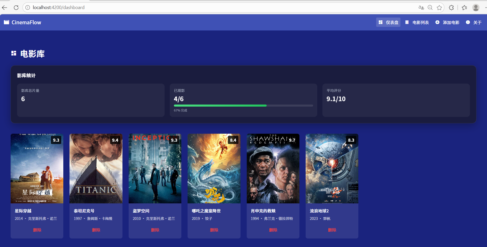
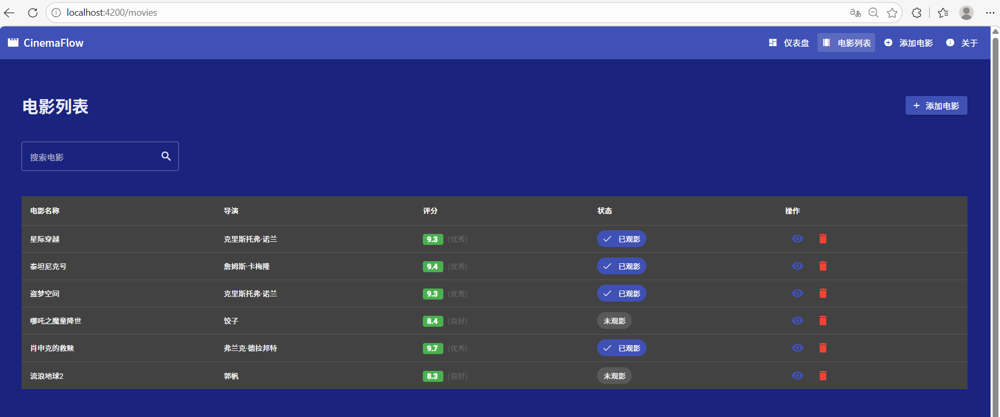
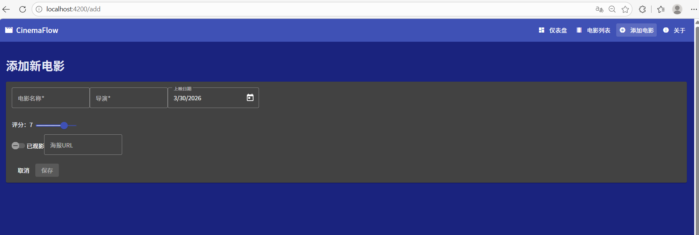
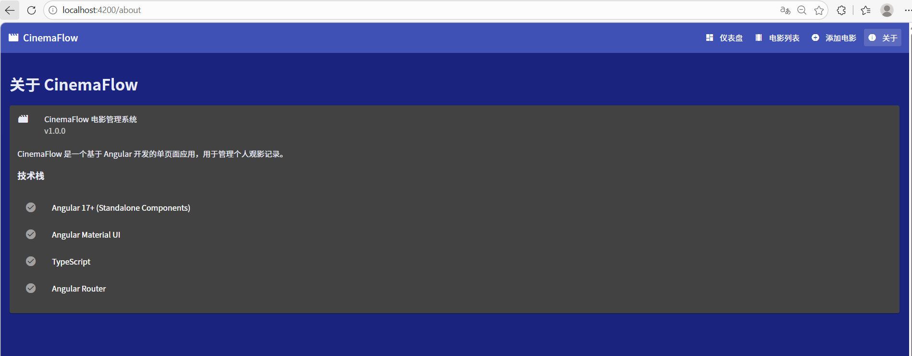

# Cinema-Flow

## 路由配置

### 关键代码位置

1. **路由配置文件**：`src/app/app.routes.ts`
   - 包含所有路由的配置，使用 `loadComponent` 实现懒加载
   - 配置了默认重定向、仪表盘、电影列表、电影详情、添加电影、关于页面的路由
   - 包含 404 页面重定向处理

2. **应用配置文件**：`src/app/app.config.ts`
   - 注入 `provideRouter(routes)` 以启用路由功能
   - 保留了其他必要的配置

3. **根组件**：`src/app/app.component.html`
   - 添加了 `<router-outlet>` 作为路由出口
   - 实现了顶部导航栏，包含路由链接和激活状态高亮

4. **页面组件**：
   - `src/app/pages/dashboard/` - 仪表盘页面
   - `src/app/pages/movie-list/` - 电影列表页面
   - `src/app/pages/movie-detail/` - 电影详情页面
   - `src/app/pages/movie-add/` - 添加电影页面
   - `src/app/pages/about/` - 关于页面

### 路由功能

- **懒加载**：所有页面都使用 `loadComponent` 实现懒加载，提高初始加载速度
- **参数路由**：`/movies/:id` 用于显示电影详情
- **查询参数**：支持通过 `?search=关键词` 进行电影搜索
- **导航高亮**：使用 `routerLinkActive` 高亮当前导航项
- **404 处理**：未匹配的路由重定向到仪表盘

**仪表盘页面截图**：

**电影列表页面截图**：

**添加电影页面截图**：

**电影详情页面截图**：

**关于页面截图**：
